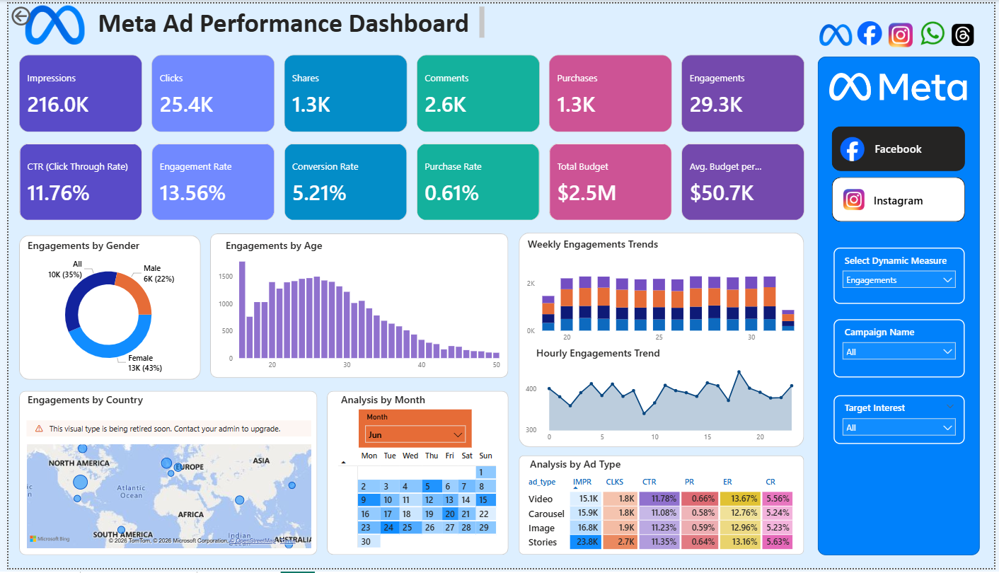

# Meta Ad Performance Dashboard

An interactive Power BI dashboard designed to analyze Meta advertising performance across key business and marketing metrics.

## 📊 Project Overview

This project analyzes Meta ad campaign data to understand advertising reach, engagement, conversions, audience behavior, geographical performance, time-based trends, and ad-type performance.

The dashboard provides a consolidated view of campaign KPIs and helps identify patterns in audience engagement and purchase conversion.

## 🛠️ Tools & Technologies

- Power BI
- Power Query
- DAX
- Data Visualization
- Data Analysis

## 📌 Key KPIs

The dashboard tracks:

- Impressions
- Clicks
- Shares
- Comments
- Purchases
- Engagements
- CTR (Click-Through Rate)
- Engagement Rate
- Conversion Rate
- Purchase Rate
- Total Budget
- Average Budget per Campaign

### Overall Performance

- **Impressions:** 216K
- **Clicks:** 25.4K
- **Shares:** 1.3K
- **Comments:** 2.6K
- **Purchases:** 1.3K
- **Engagements:** 29K
- **CTR:** 11.76%
- **Engagement Rate:** 13.56%
- **Conversion Rate:** 5.21%
- **Purchase Rate:** 0.61%
- **Total Budget:** 2.5M

## 📈 Dashboard Analysis

### 1. Engagement by Gender

The dashboard analyzes engagement across different gender categories.

- Female: 13K (43%)
- Male: 6K (22%)
- Other/Not Specified: 10K (35%)

### 2. Engagement by Age

The highest engagement is observed among the **20–30 age group**, while engagement decreases considerably among older age groups.

### 3. Geographic Analysis

The major contributors to engagement include:

- United States
- India
- Brazil
- Germany
- United Kingdom

### 4. Time-Based Analysis

The dashboard analyzes engagement across both weekly and hourly trends.

Engagement is relatively consistent across weeks, while hourly analysis shows stronger engagement during the **afternoon and evening hours**, approximately 15:00–20:00.

### 5. Ad Type Performance

The dashboard compares:

- Carousel
- Image
- Stories
- Video

| Ad Type | Impressions | Clicks | CTR | Purchase Rate | Conversion Rate | Engagement Rate |
|----------|-------------|--------|-----|---------------|-----------------|-----------------|
| Carousel | 48K | 6K | 11.7% | 0.59% | 5.1% | 13.4% |
| Image | 51K | 6K | 11.7% | 0.57% | 4.9% | 13.5% |
| Stories | 72K | 8K | 11.8% | 0.65% | 5.2% | 13.6% |
| Video | 46K | 5K | 11.9% | 0.62% | 5.2% | 13.7% |

## 🔍 Key Insights

- The campaigns show strong visibility and engagement.
- CTR and engagement rate indicate strong top-of-funnel interaction.
- Purchase rate is comparatively lower, indicating a drop-off further down the conversion funnel.
- The 20–30 age group shows the highest engagement.
- Female users contribute a larger share of engagement than male users.
- Video and Stories show strong performance across engagement and conversion metrics.
- Engagement is stronger during afternoon and evening hours.
- Certain dates show higher engagement, indicating increased campaign activity during specific periods.

## 💡 Business Recommendations

Based on the dashboard analysis:

1. Improve the lower-funnel conversion strategy.
2. Focus audience analysis on highly engaged age and demographic segments.
3. Evaluate greater budget allocation toward high-performing ad formats.
4. Schedule campaigns during higher-engagement time periods.
5. Optimize landing pages and offers to improve purchase conversion.
6. Use retargeting strategies to improve conversion efficiency.

## 📷 Dashboard Preview

Add screenshots of the Power BI dashboard here.

